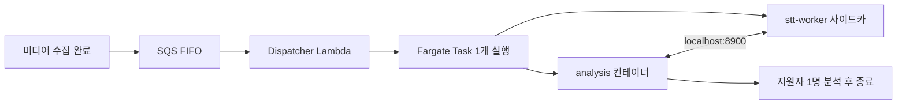
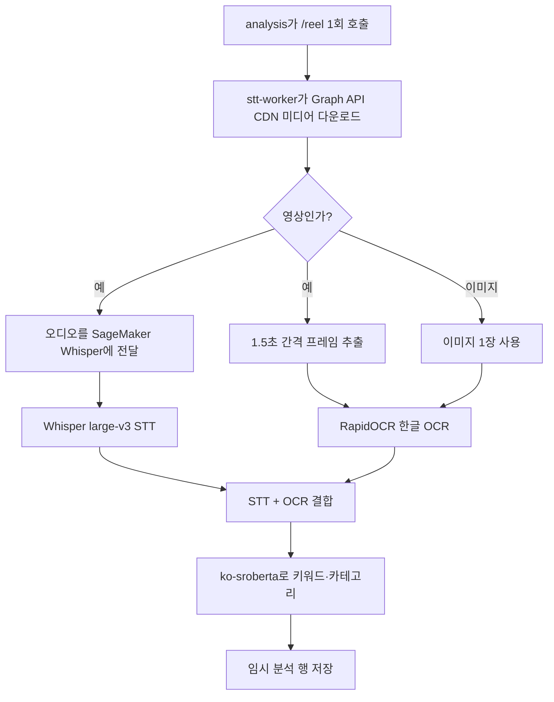
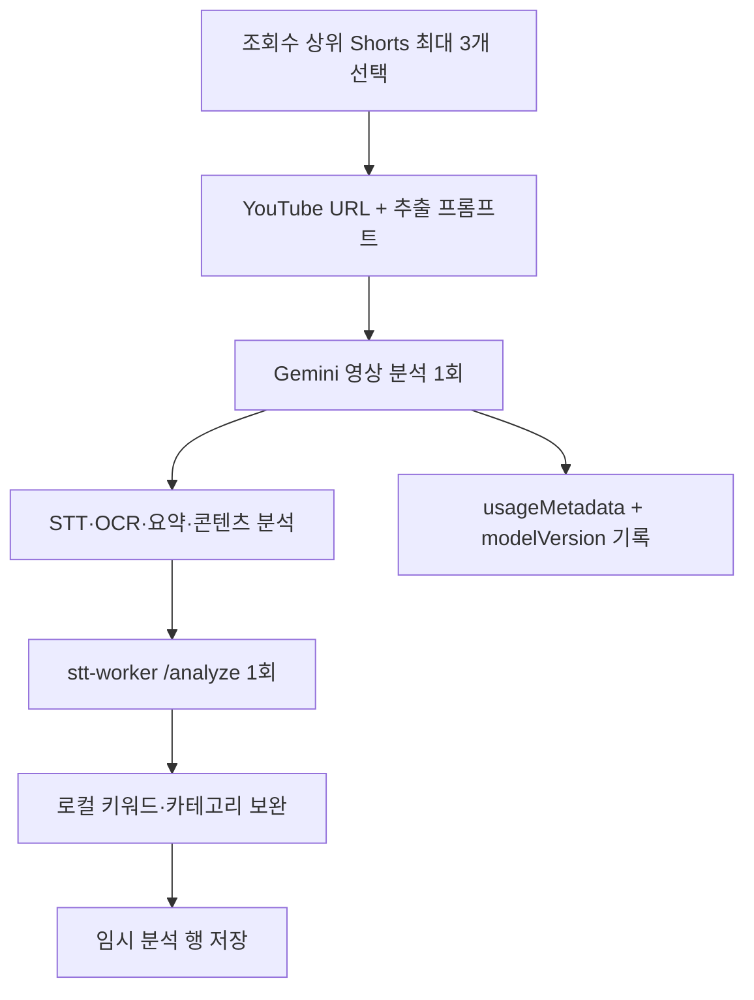
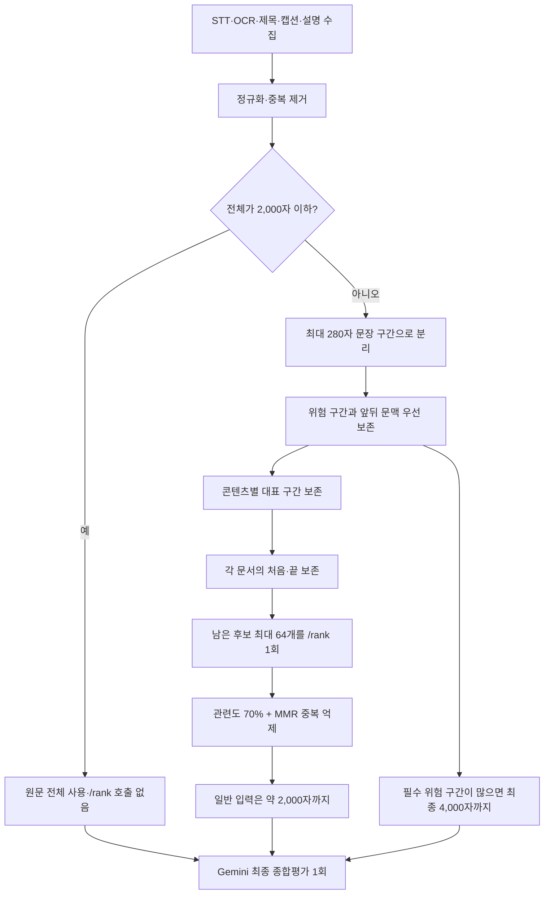
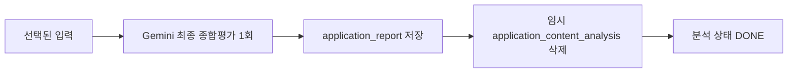

# 지원자 콘텐츠 분석·Gemini 비용 운영 문서

기준일: 2026-08-27

## 먼저 결론

이 파이프라인에는 서로 다른 역할의 "워커"가 두 개 있다.

- `analysis` 컨테이너: Java 애플리케이션이다. 지원자 한 명의 분석 순서를 지휘하고 DB를 읽고 쓴다.
- `stt-worker` 사이드카: 같은 Fargate Task 안에서 실행되는 Python HTTP 서버다. Instagram 미디어 취득·OCR, 로컬 키워드/카테고리 분석, 문장 임베딩 순위 계산을 담당한다.
- SageMaker Whisper: `stt-worker`가 Instagram 영상의 무거운 음성 인식만 맡기는 별도 GPU 엔드포인트다.
- Gemini: YouTube 영상별 분석과 지원자 최종 종합평가를 담당한다.

따라서 `stt-worker`는 별도 원격 서비스로 여러 번 네트워크를 왕복하는 구조가 아니다. 운영에서는 Java와 같은 Fargate Task 안에 있는 사이드카이고 `127.0.0.1:8900`으로 통신한다. 다만 Instagram STT만 SageMaker에 비동기 요청한다.

## 1. 작업은 어떻게 시작되는가



핵심은 "지원자 한 명당 일회성 Fargate Task 한 개"다. SQS 이벤트 소스의 배치 크기는 1이고, 이미 실행 중인 Task가 있으면 새 Task를 겹쳐 띄우지 않는다. 평상시 시작은 SQS가 담당한다. EventBridge Scheduler의 1시간 주기 호출은 메시지 누락이나 시작 실패 복구용이다.

운영 Task 사양은 ARM64 Linux, 2 vCPU, 메모리 4 GB다. `stt-worker`가 먼저 건강 상태가 될 때까지 기다린 뒤 `analysis`가 시작한다.

## 2. Instagram 콘텐츠 한 건의 처리



Instagram은 Gemini로 콘텐츠별 분석을 하지 않는다. 음성은 `faster-whisper large-v3`, 화면 글자는 RapidOCR PP-OCRv4 한국어 모바일 모델을 사용한다. 운영에서는 Whisper만 `whisper-large-v3-async` SageMaker GPU 엔드포인트로 오프로드하고, 미디어 취득·프레임 추출·OCR·로컬 분류는 사이드카가 수행한다.

`/reel` 응답에는 STT, OCR, 키워드, 카테고리가 함께 들어오므로 Java가 같은 콘텐츠에 `/analyze`를 한 번 더 호출하지 않는다.

## 3. YouTube 콘텐츠 한 건의 처리



YouTube는 영상을 다운로드해 로컬 Whisper에 넣지 않는다. `YoutubeSttClient`가 YouTube watch URL을 Gemini에 직접 전달한다. 지원자별 모든 영상이 아니라 `SHORTS` 중 조회수 상위 최대 3개만 호출한다.

영상 분석 뒤에도 `/analyze`를 부르는 이유는 카테고리와 키워드의 판정 기준을 Instagram과 동일한 로컬 모델로 맞추기 위해서다. Gemini의 분석 결과 전체를 다시 요약하는 워커가 아니라, 이미 뽑힌 STT/OCR 텍스트에서 키워드·카테고리만 계산한다.

이번 변경으로 영상별 Gemini 호출마다 다음 로그가 남는다.

```text
YouTube Gemini 영상 분석 완료. videoId=..., model=..., latencyMs=...,
promptTokens=..., outputTokens=..., thoughtTokens=..., totalTokens=...
```

`usageMetadata`가 없는 비정상 응답도 호출 자체를 놓치지 않도록 `tokenUsage=unavailable`로 기록한다.

## 4. 최종 종합평가 전에 어떻게 입력을 줄이는가



여기서 중요한 점은 "가중치 단어만 보고 나머지를 버리는 규칙 기반 요약"이 아니라는 것이다.

1. 2,000자 이하면 아무것도 줄이지 않는다.
2. 길 때만 문장 구간으로 나눈다.
3. 광고·협찬·효능·부작용·주의·정치·종교·건강·욕설 같은 검수 신호는 규칙으로 강제 보존하고 앞뒤 문맥도 같이 남긴다.
4. 각 콘텐츠의 대표 구간과 STT/OCR/제목/캡션/설명의 처음·끝을 남겨 한 콘텐츠가 통째로 사라지는 것을 막는다.
5. 남은 구간은 `jhgan/ko-sroberta-multitask` 임베딩으로 검수 목표와의 의미 관련도를 계산한다. MMR로 이미 선택한 문장과 비슷한 문장은 감점한다.
6. 임베딩 워커가 실패하면 규칙 점수와 텍스트 유사도 기반 순서로 폴백하며 최종 리포트 생성을 막지 않는다.

즉 규칙은 "절대 빠지면 안 되는 구간"의 안전망이고, 임베딩은 표현이 달라 키워드 규칙에 걸리지 않는 관련 문장을 찾는 보완 장치다. Gemini로 미리 요약하지 않기 때문에 입력 절감용 추가 Gemini 호출도 없다.

## 5. 최종 저장



최종 Gemini는 요약, 스타일, 톤, 강점, 주의점, 위험, 협업 브랜드를 JSON으로 만든다. 로컬에서 안정적으로 얻은 카테고리·키워드가 있으면 그것을 우선하고, 비어 있을 때만 Gemini 값을 사용한다. 리포트 저장, 임시 데이터 삭제, `DONE` 변경은 한 트랜잭션으로 처리한다.

## 6. 모델과 호출 횟수

| 구간 | 모델/서비스 | 지원자 1명당 호출 |
|---|---|---:|
| Instagram 미디어 | `stt-worker /reel` | 분석 대상 Instagram 미디어 수만큼 |
| Instagram 음성 | SageMaker `whisper-large-v3-async` | 오디오가 있는 영상 수 이하 |
| YouTube 영상 | 기본 `gemini-3.5-flash-lite`, 폴백 `gemini-3.6-flash` | 상위 Shorts 수, 0~3회 |
| YouTube 로컬 분류 | `stt-worker /analyze`, `jhgan/ko-sroberta-multitask` | 성공한 YouTube 영상 수, 0~3회 |
| 긴 최종 입력 순위 | `stt-worker /rank`, 같은 ko-sroberta | 0~1회 |
| 최종 종합평가 | 기본 `gemini-3.5-flash-lite`, 폴백 `gemini-3.6-flash` | 1회 |

하루의 실제 지원자 수가 아직 이 문서에 입력되지 않았으므로 고정된 하루 호출 수를 임의로 만들 수는 없다. 다음 식으로 계산한다.

- 하루 Instagram 지원자 수를 `I`, YouTube 지원자 수를 `Y`라고 한다.
- YouTube 지원자당 실제 분석 Shorts 평균을 `S`라고 한다. `0 ≤ S ≤ 3`이다.
- 긴 최종 입력 비율을 `R`이라고 한다. `0 ≤ R ≤ 1`이다.
- 하루 Gemini 호출 수 = `I + Y × (S + 1)`
- 하루 `/rank` 호출 수 = `(I + Y) × R`
- 하루 YouTube `/analyze` 호출 수 = `Y × S`

예를 들어 하루 Instagram 지원자 80명, YouTube 지원자 20명, YouTube Shorts 평균 2.5개라면 Gemini는 `80 + 20 × 3.5 = 150회/일`이다. 실제 값은 아래 사용량 로그 집계로 대체해야 한다.

## 7. 토큰 비용

2026-08-27 기준 표준 유료 요금은 다음과 같다.

| 모델 | 입력 100만 토큰 | 출력 100만 토큰 | 비고 |
|---|---:|---:|---|
| `gemini-3.5-flash-lite` | $0.30 | $2.50 | 출력 단가에 thinking 토큰 포함 |
| `gemini-3.6-flash` | $0.75 | $3.75 | 2026-12-31까지의 프로모션 단가 |

공식 자료: [Gemini API 가격표](https://ai.google.dev/gemini-api/docs/pricing), [토큰 계산과 usageMetadata](https://ai.google.dev/api/tokens), [영상 토큰 계산](https://ai.google.dev/gemini-api/docs/video-understanding)

호출 한 건의 계산식은 다음과 같다.

```text
비용 USD = promptTokenCount × 입력단가 / 1,000,000
         + (candidatesTokenCount + thoughtsTokenCount) × 출력단가 / 1,000,000
```

`totalTokenCount`는 검산용이다. 출력 비용은 `candidates + thoughts`로 계산한다. 실제 성공 모델은 `modelVersion`으로 단가를 선택한다.

### 최종 종합평가 예상

한글 글자 수와 토큰 수는 일대일이 아니므로 아래는 범위 추정이며, 배포 후 로그가 기준값이다. 고정 지시문은 약 929자이고 선택된 콘텐츠가 일반적으로 약 2,000자, 검수 필수 구간이 많으면 최대 4,000자다.

| 경우 | 추정 입력 토큰 | 추정 출력+thinking | Flash-Lite 예상 비용/리포트 |
|---|---:|---:|---:|
| 일반 | 1,600~3,200 | 250~500 | $0.0011~$0.0022 |
| 검수 구간 다수 | 2,600~5,200 | 250~500 | $0.0014~$0.0028 |
| 출력이 1,024 토큰 상한까지 사용 | 위 입력 범위 | 1,024 | $0.0030~$0.0041 |

### YouTube 영상 분석 예상

현재 영상 입력은 기본 `LOW` 해상도다. Google 문서 기준 영상은 LOW에서 대략 초당 100토큰이므로 영상 입력만 약 6,000토큰/분이다. 실제 값에는 프롬프트와 메타데이터가 더해진다.

- 60초 영상, 총 입력 약 6,500토큰, 출력+thinking 500토큰 가정: Flash-Lite 약 `$0.0032/영상`
- 180초 영상, 총 입력 약 18,500토큰, 출력+thinking 500토큰 가정: Flash-Lite 약 `$0.0068/영상`
- 60초 영상 3개와 일반 최종 취합 1회: 약 `$0.0107~$0.0118/지원자`
- 180초 영상 3개와 일반 최종 취합 1회: 약 `$0.0215~$0.0226/지원자`

영상 길이와 실제 출력 토큰 차이가 크므로 이 수치는 예산용이다. 이번에 추가한 YouTube `usageMetadata` 로그가 쌓이면 추정을 버리고 실측 비용으로 계산한다.

## 8. 얼마나 줄였는가

아래는 콘텐츠 문자 수 기준 이론값이다. 고정 프롬프트 929자를 포함한 전체 입력 절감률도 같이 표시했다.

| 원본 콘텐츠 | 선택 콘텐츠 | 콘텐츠 절감 | 고정 프롬프트 포함 절감 |
|---:|---:|---:|---:|
| 3,000자 | 2,000자 | 33.3% | 25.5% |
| 6,000자 | 2,000자 | 66.7% | 57.7% |
| 10,000자 | 2,000자 | 80.0% | 73.2% |
| 6,000자 | 4,000자(검수 구간 다수) | 33.3% | 28.9% |
| 10,000자 | 4,000자(검수 구간 다수) | 60.0% | 54.9% |

문자 절감률은 토큰 절감률과 같지 않다. 실제 토큰 절감은 변경 전 기준 로그가 없으므로 소급해 정확히 계산할 수 없다. 현재부터 `rawChars`, `selectedChars`, `promptTokens`를 수집해 주·배포 버전별로 비교한다.

## 9. 성능 측정 기준

현재 로그로 다음 지표를 일 단위와 p50/p95로 집계한다.

| 영역 | 지표 | 판단 목적 |
|---|---|---|
| 선택기 | `rawChars`, `selectedChars`, `truncated` | 실제 입력 절감률 |
| 선택기 | `selectorMs` | 입력 절감 자체의 지연 |
| 선택기 | `rankingAttempted`, `semanticRanking` | `/rank` 호출률과 폴백률 |
| 선택기 | `selectedSegments`, `contentCoverage` | 압축 과정의 콘텐츠 누락 여부 |
| Gemini | `model`, `promptTokens`, `outputTokens`, `thoughtTokens`, `totalTokens` | 모델별 실제 비용 |
| Gemini | `latencyMs` | YouTube 영상/최종 취합 지연 p50·p95 |
| 품질 | 위험 구간 재현율, 카테고리 정확도, 리뷰어 수정률 | 비용 절감으로 검수 품질이 떨어졌는지 확인 |

CloudWatch Logs Insights에서는 먼저 다음처럼 일 호출량을 센다.

```sql
fields @timestamp, @message
| filter @message like /YouTube Gemini 영상 분석 완료|Gemini 취합 완료/
| stats count(*) as geminiCalls by bin(1d)
```

토큰 필드까지 집계할 때는 로그를 파싱한다.

```sql
fields @timestamp, @message
| filter @message like /YouTube Gemini 영상 분석 완료|Gemini 취합 완료/
| parse @message /model=(?<model>[^,]+).*promptTokens=(?<prompt>\d+), outputTokens=(?<output>\d+), thoughtTokens=(?<thought>\d+), totalTokens=(?<total>\d+)/
| stats count(*) as calls,
        sum(prompt) as inputTokens,
        sum(output) as outputTokens,
        sum(thought) as thoughtTokens,
        sum(total) as totalTokens
  by bin(1d), model
```

배포 전후 비교의 최소 조건은 같은 지원자 샘플을 사용하는 것이다. 특히 위험 문구가 없는 일반군과 광고·건강·정치·혐오 신호가 있는 검수군을 나눠서 비용, 지연, 위험 구간 재현율을 함께 비교해야 한다.

## 10. 배포 방식과 워커 효능

로컬에서는 다음 프로필로 Spring 앱과 Python 워커를 같은 Docker Compose 네트워크에 띄운다.

```bash
docker compose --profile analysis-local up -d --build
```

로컬 앱은 `http://stt-worker:8900`으로 워커를 호출한다. 운영에서는 GitHub Actions의 `Deploy analysis worker`가 Java 이미지와 worker 이미지를 포함한 CloudFormation 스택을 배포한다. Fargate 안에서는 같은 Task의 `http://127.0.0.1:8900`을 사용한다.

워커의 효능은 다음 세 가지다.

1. Instagram에는 콘텐츠별 Gemini를 사용하지 않아 외부 LLM 토큰을 쓰지 않는다.
2. 최종 취합 전에 로컬 임베딩으로 중복 문장을 제거해 Gemini 입력을 줄인다.
3. Java 애플리케이션과 같은 Task에 붙어 있으므로 `/analyze`, `/rank`의 네트워크 지연이 작고, 무거운 Whisper GPU 처리만 SageMaker로 분리한다.

주의할 점도 있다. `jhgan/ko-sroberta-multitask`는 현재 Dockerfile에서 가중치를 이미지에 미리 굽지 않고 첫 사용 시 로드한다. 일회성 Fargate Task마다 다운로드 또는 캐시 미스로 초기 지연이 생기는지는 배포 로그에서 반드시 확인해야 한다. p95 `selectorMs`가 커지면 다음 최적화 우선순위는 모델 가중치를 worker 이미지에 포함하는 것이다.
